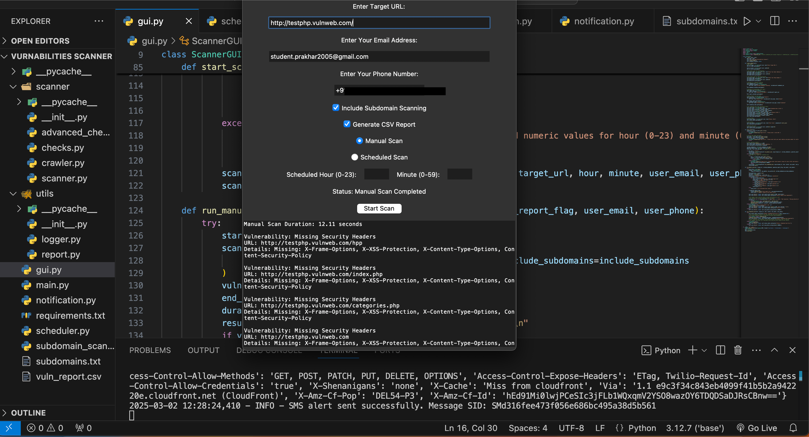

# 🛡️ Network Security Scanner

> A Python-based tool to scan networks, discover hosts, analyze open ports, detect services, and highlight potential vulnerabilities.  
> Built with a focus on **clarity, modularity, and real-world impact**.

---

## 🔎 How It Works (Step by Step)

1. **Target Input**  
   - User provides an IP address, domain, or subnet (e.g., `192.168.1.0/24`).  
   - The scanner validates the input and prepares the range.

2. **Host Discovery**  
   - Uses ICMP ping or ARP requests (via `scapy`) to check which hosts are alive.  
   - Active hosts are added to the scan list.

3. **Port Scanning**  
   - For each host, TCP/UDP ports are probed using `socket` and `scapy`.  
   - Multi-threading (`threading`, `concurrent.futures`) speeds up the process.  
   - Results are categorized: **open**, **closed**, or **filtered**.

4. **Service Detection**  
   - Open ports are fingerprinted using banner grabbing (`socket`, `requests`).  
   - Services like HTTP, FTP, SSH are identified, along with version info.

5. **Vulnerability Checks**  
   - Simple rule-based checks (e.g., default ports, weak services).  
   - Can be extended to query CVE databases using `requests` + APIs.

6. **Report Generation**  
   - Results are structured into JSON/HTML using `json`, `jinja2`, `pandas`.  
   - Reports include host summary, port status, and detected services.

7. **User-Friendly Output**  
   - Console output with colored highlights (`colorama`, `rich`).  
   - Exported reports for recruiters/managers to review.

---

## 📚 Libraries Used

- **Core Networking**
  - `socket` – low-level port scanning  
  - `scapy` – packet crafting & sniffing  
  - `ipaddress` – subnet calculations  

- **Performance**
  - `threading` / `concurrent.futures` – parallel scanning  
  - `asyncio` – async tasks for faster probes  

- **Data Handling**
  - `json` – structured output  
  - `pandas` – tabular report formatting  
  - `jinja2` – HTML report templates  

- **User Experience**
  - `argparse` – command-line arguments  
  - `colorama` / `rich` – colored console output  
  - `tabulate` – pretty tables  

- **Optional Enhancements**
  - `requests` – service banner grabbing & CVE API calls  
  - `logging` – structured logs for debugging  

---

## 🚀 Usage
```bash
# Basic scan
python scanner.py --target 192.168.1.1

# Range scan
python scanner.py --target 192.168.1.0/24

# Specific ports
python scanner.py --target 192.168.1.1 --ports 22,80,443

# Export results
python scanner.py --target 192.168.1.1 --output report.html

## 📸 Screenshots

 Scanner Running


### Sample Report


